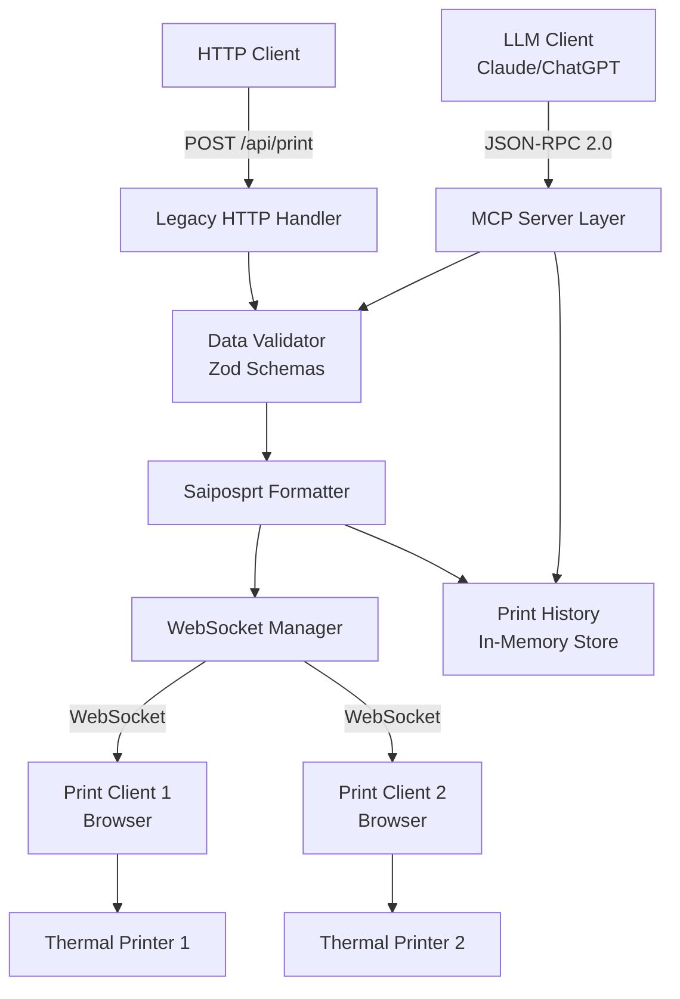

# Design Document: MCP Thermal Print Server

## Overview

Este documento descreve o design técnico para transformar um sistema de impressão térmica remota existente em um servidor MCP (Model Context Protocol). O sistema manterá toda a funcionalidade atual (HTTP POST endpoint e WebSocket para clientes) enquanto adiciona uma camada MCP que expõe ferramentas estruturadas para LLMs.

O servidor será implementado em Node.js com TypeScript, utilizando o SDK oficial `@modelcontextprotocol/sdk`. A arquitetura seguirá o padrão JSON-RPC 2.0 conforme especificado pelo MCP, permitindo que LLMs descubram e invoquem ferramentas de impressão de forma padronizada.

**Principais Características:**
- Compatibilidade total com sistema existente (backward compatibility)
- Exposição de 3 ferramentas MCP: `send_print_job`, `check_printer_status`, `get_print_history`
- Validação robusta de dados usando Zod schemas
- Histórico de impressões em memória (últimas 1000 entradas)
- Comunicação via HTTP para MCP e WebSocket para clientes de impressão

## Architecture

### High-Level Architecture



### Component Layers

**1. Transport Layer**
- HTTP Server (Express) para requisições MCP e legacy
- WebSocket Server (Socket.io) para comunicação com clientes de impressão

**2. Protocol Layer**
- MCP Server usando `@modelcontextprotocol/sdk`
- JSON-RPC 2.0 message handling
- Tool registration and discovery

**3. Business Logic Layer**
- Data validation (Zod schemas)
- Saiposprt format generation
- Print job management
- Connection management

**4. Storage Layer**
- In-memory circular buffer para histórico (max 1000 entradas)
- WebSocket connection registry

## Components and Interfaces

### 1. MCP Server Component

**Responsabilidade:** Implementar o protocolo MCP e expor ferramentas para LLMs.

**Interface:**
```typescript
interface MCPServerConfig {
  name: string;
  version: string;
  port: number;
}

class MCPThermalPrintServer {
  constructor(config: MCPServerConfig);
  
  // Inicializa o servidor MCP e registra ferramentas
  async initialize(): Promise<void>;
  
  // Registra uma ferramenta MCP
  registerTool<T>(
    name: string,
    schema: ToolSchema,
    handler: (input: T) => Promise<ToolResponse>
  ): void;
  
  // Inicia o servidor HTTP
  async start(): Promise<void>;
  
  // Para o servidor
  async stop(): Promise<void>;
}
```

**Ferramentas Expostas:**

1. **send_print_job**
   - Input: `OrderData` (id, customer, address, items, total)
   - Output: `{ success: boolean, jobId: string, message: string }`
   - Descrição: Envia um pedido para impressão térmica

2. **check_printer_status**
   - Input: nenhum
   - Output: `{ connectedClients: number, clients: ClientInfo[] }`
   - Descrição: Verifica status de conexão dos clientes de impressão

3. **get_print_history**
   - Input: `{ limit?: number }` (default: 50, max: 1000)
   - Output: `{ jobs: PrintJob[], total: number }`
   - Descrição: Retorna histórico de impressões recentes

### 2. Data Validator Component

**Responsabilidade:** Validar dados de entrada usando Zod schemas.

**Interface:**
```typescript
import { z } from 'zod';

// Schema para item do pedido
const OrderItemSchema = z.object({
  quantity: z.number().positive().describe('Quantidade do item'),
  name: z.string().min(1).describe('Nome do item'),
  price: z.number().nonnegative().describe('Preço unitário')
});

// Schema para dados do pedido
const OrderDataSchema = z.object({
  id: z.number().positive().describe('ID único do pedido'),
  customer: z.string().min(1).describe('Nome do cliente'),
  address: z.string().optional().describe('Endereço de entrega'),
  items: z.array(OrderItemSchema).min(1).describe('Itens do pedido'),
  total: z.number().nonnegative().describe('Valor total do pedido')
});

type OrderData = z.infer<typeof OrderDataSchema>;
type OrderItem = z.infer<typeof OrderItemSchema>;

class DataValidator {
  // Valida dados do pedido
  validateOrderData(data: unknown): ValidationResult<OrderData>;
  
  // Valida limite do histórico
  validateHistoryLimit(limit: unknown): ValidationResult<number>;
}

interface ValidationResult<T> {
  success: boolean;
  data?: T;
  error?: string;
}
```

### 3. Saiposprt Formatter Component

**Responsabilidade:** Converter `OrderData` para o formato .saiposprt.

**Interface:**
```typescript
interface SaiposSettings {
  type: number;
  printDelivery: number;
  printTable: number;
  printServiceTicket: number;
  layout: number;
  rowColumns: number;
  copies: number;
  emptyLines: number;
  emptyChar: string;
  fontSize: number;
  escpos: boolean;
  idStore: number;
  guid: string;
  id_user: number;
  fileName: string;
}

interface SaiposPrintData {
  printSettings: SaiposSettings;
  printRows: string[];
  sale_number: string;
  id_sale: number;
  logData: {
    id_store: number;
    id_sale: number;
    print_sent_user: number;
    print_sent_method: number;
    print_auto: string;
  };
}

class SaiposFormatter {
  constructor(config: { idStore: number; idUser: number });
  
  // Formata OrderData para Saiposprt
  format(orderData: OrderData): string;
  
  // Gera as linhas de impressão
  private generatePrintRows(orderData: OrderData): string[];
  
  // Gera configurações de impressão
  private generatePrintSettings(orderId: number): SaiposSettings;
  
  // Codifica para formato data URL
  private encodeToDataUrl(data: SaiposPrintData): string;
}
```

**Formato de Saída:**
```
data:text/json;charset=utf-8,<base64_encoded_json>
```

### 4. WebSocket Manager Component

**Responsabilidade:** Gerenciar conexões WebSocket e enviar dados para clientes.

**Interface:**
```typescript
interface ClientInfo {
  id: string;
  connectedAt: Date;
  socketId: string;
}

class WebSocketManager {
  private io: Server;
  private clients: Map<string, ClientInfo>;
  
  constructor(httpServer: HttpServer);
  
  // Inicializa o servidor WebSocket
  initialize(): void;
  
  // Envia dados para todos os clientes conectados
  broadcast(data: string): BroadcastResult;
  
  // Retorna informações dos clientes conectados
  getConnectedClients(): ClientInfo[];
  
  // Retorna número de clientes conectados
  getClientCount(): number;
  
  // Manipuladores de eventos
  private onConnection(socket: Socket): void;
  private onDisconnect(clientId: string): void;
}

interface BroadcastResult {
  success: boolean;
  clientCount: number;
  error?: string;
}
```

### 5. Print History Component

**Responsabilidade:** Armazenar e recuperar histórico de impressões.

**Interface:**
```typescript
interface PrintJob {
  id: string;
  orderId: number;
  customer: string;
  total: number;
  timestamp: Date;
  status: 'sent' | 'failed';
  clientCount: number;
}

class PrintHistory {
  private jobs: PrintJob[];
  private maxSize: number;
  
  constructor(maxSize: number = 1000);
  
  // Adiciona um job ao histórico
  add(job: Omit<PrintJob, 'id' | 'timestamp'>): PrintJob;
  
  // Recupera jobs recentes
  getRecent(limit: number = 50): PrintJob[];
  
  // Retorna total de jobs no histórico
  getCount(): number;
  
  // Limpa o histórico
  clear(): void;
}
```

### 6. Legacy HTTP Handler Component

**Responsabilidade:** Manter compatibilidade com endpoint HTTP existente.

**Interface:**
```typescript
class LegacyHttpHandler {
  constructor(
    private validator: DataValidator,
    private formatter: SaiposFormatter,
    private wsManager: WebSocketManager,
    private history: PrintHistory
  );
  
  // Manipula POST /api/print
  async handlePrintRequest(req: Request, res: Response): Promise<void>;
}
```

## Data Models

### OrderData Model
```typescript
interface OrderData {
  id: number;              // ID único do pedido
  customer: string;        // Nome do cliente
  address?: string;        // Endereço de entrega (opcional)
  items: OrderItem[];      // Lista de itens
  total: number;           // Valor total
}

interface OrderItem {
  quantity: number;        // Quantidade (> 0)
  name: string;            // Nome do item
  price: number;           // Preço unitário (>= 0)
}
```

### PrintJob Model
```typescript
interface PrintJob {
  id: string;              // UUID do job
  orderId: number;         // ID do pedido original
  customer: string;        // Nome do cliente
  total: number;           // Valor total
  timestamp: Date;         // Data/hora do envio
  status: 'sent' | 'failed'; // Status do envio
  clientCount: number;     // Número de clientes que receberam
}
```

### ClientInfo Model
```typescript
interface ClientInfo {
  id: string;              // ID único do cliente
  connectedAt: Date;       // Data/hora da conexão
  socketId: string;        // ID do socket Socket.io
}
```

### MCP Tool Response Models
```typescript
// Resposta de send_print_job
interface SendPrintJobResponse {
  success: boolean;
  jobId: string;
  message: string;
  clientCount?: number;
}

// Resposta de check_printer_status
interface PrinterStatusResponse {
  connectedClients: number;
  clients: Array<{
    id: string;
    connectedAt: string;  // ISO 8601
  }>;
}

// Resposta de get_print_history
interface PrintHistoryResponse {
  jobs: Array<{
    id: string;
    orderId: number;
    customer: string;
    total: number;
    timestamp: string;    // ISO 8601
    status: string;
    clientCount: number;
  }>;
  total: number;
  limit: number;
}
```


## Correctness Properties

*Uma propriedade é uma característica ou comportamento que deve ser verdadeiro em todas as execuções válidas de um sistema - essencialmente, uma declaração formal sobre o que o sistema deve fazer. As propriedades servem como ponte entre especificações legíveis por humanos e garantias de correção verificáveis por máquina.*

### Property Reflection

Após analisar todos os critérios de aceitação, identifiquei as seguintes redundâncias:
- Propriedade 7.2 é redundante com 3.6 (ambas testam mensagens de erro de validação)
- Propriedade 7.3 é redundante com 2.5 (ambas testam erro quando não há clientes)
- Propriedades 8.1 e 8.2 podem ser combinadas em uma propriedade de round-trip para formato Saiposprt

As propriedades abaixo foram refinadas para eliminar redundâncias e focar em validações únicas.

### Property 1: MCP Tool Discovery Response Validity
*Para qualquer* conexão de LLM ao servidor, a resposta de descoberta de ferramentas deve conter todas as três ferramentas esperadas (send_print_job, check_printer_status, get_print_history) com schemas JSON válidos.

**Validates: Requirements 1.2**

### Property 2: MCP Request Format Acceptance
*Para qualquer* requisição MCP válida no formato JSON-RPC 2.0, o servidor deve aceitá-la e processá-la sem erros de formato.

**Validates: Requirements 1.3**

### Property 3: MCP Response Format Compliance
*Para qualquer* invocação de ferramenta, a resposta deve estar em conformidade com o formato MCP padrão (JSON-RPC 2.0 com campos obrigatórios).

**Validates: Requirements 1.4**

### Property 4: Order Data Field Validation
*Para qualquer* OrderData com campos inválidos (id não-positivo, customer vazio, items vazio, item com quantity não-positiva, item com name vazio, item com price negativo, ou total negativo), a validação deve falhar e retornar uma mensagem de erro descritiva identificando o campo específico.

**Validates: Requirements 3.1, 3.2, 3.3, 3.4, 3.5, 3.6**

### Property 5: Valid Order Data Formatting
*Para qualquer* OrderData válido, a formatação deve produzir uma string no formato Saiposprt válido (data URL com JSON codificado em base64).

**Validates: Requirements 2.3, 8.3**

### Property 6: Saiposprt Format Round Trip
*Para qualquer* OrderData válido, após formatá-lo para Saiposprt e decodificar (base64 decode + JSON parse), o objeto resultante deve conter todos os dados originais do pedido (id, customer, items, total).

**Validates: Requirements 8.1, 8.2, 8.4, 8.5**

### Property 7: Saiposprt Filename Generation
*Para qualquer* OrderData com id N, o nome do arquivo gerado no formato Saiposprt deve ser "N.saiposprt".

**Validates: Requirements 8.6**

### Property 8: WebSocket Broadcast to All Clients
*Para qualquer* número N de clientes conectados (N > 0), quando dados formatados são enviados, todos os N clientes devem receber os dados via WebSocket.

**Validates: Requirements 2.4, 9.4**

### Property 9: Successful Print Job Response
*Para qualquer* envio bem-sucedido de print job, a resposta deve conter success=true e um jobId não-vazio.

**Validates: Requirements 2.6, 7.1**

### Property 10: Printer Status Client Count Accuracy
*Para qualquer* número N de clientes conectados, invocar check_printer_status deve retornar connectedClients=N.

**Validates: Requirements 4.2**

### Property 11: Printer Status Client Details Completeness
*Para qualquer* cliente conectado, os detalhes retornados por check_printer_status devem incluir id (não-vazio) e connectedAt (timestamp válido).

**Validates: Requirements 4.3**

### Property 12: Print History Limit Enforcement
*Para qualquer* limite L fornecido ao get_print_history, o número de jobs retornados deve ser no máximo L.

**Validates: Requirements 5.3**

### Property 13: Print History Entry Completeness
*Para qualquer* entrada no histórico de impressão, ela deve conter todos os campos obrigatórios: id, orderId, customer, total, timestamp, status, clientCount.

**Validates: Requirements 5.4**

### Property 14: Print History Circular Buffer Size
*Para qualquer* sequência de mais de 1000 print jobs adicionados ao histórico, o tamanho do histórico deve permanecer em no máximo 1000 entradas.

**Validates: Requirements 5.5**

### Property 15: Legacy HTTP Endpoint Compatibility
*Para qualquer* OrderData válido enviado via POST /api/print, o processamento deve produzir o mesmo resultado que o envio via ferramenta MCP send_print_job.

**Validates: Requirements 6.2**

### Property 16: Saiposprt Format Structure Consistency
*Para qualquer* OrderData formatado, a estrutura do Saiposprt deve conter os campos obrigatórios: printSettings, printRows, sale_number, id_sale, logData.

**Validates: Requirements 6.4**

### Property 17: WebSocket Connection Unique IDs
*Para qualquer* conjunto de N clientes conectados simultaneamente, todos devem ter IDs únicos (sem duplicatas).

**Validates: Requirements 9.2**

### Property 18: WebSocket Disconnection Cleanup
*Para qualquer* cliente que se desconecta, após a desconexão o número de clientes conectados deve diminuir em 1.

**Validates: Requirements 9.3**

### Property 19: Tool Documentation Completeness
*Para qualquer* ferramenta exposta pelo servidor MCP, ela deve ter description não-vazia, inputSchema válido, e documentação de output format.

**Validates: Requirements 10.1, 10.2, 10.4**

### Property 20: Error Response Safety
*Para qualquer* erro inesperado durante processamento, a resposta de erro não deve conter stack traces ou detalhes internos de implementação.

**Validates: Requirements 7.5**

## Error Handling

### Validation Errors
- **Trigger:** Dados de entrada inválidos (campos faltando, tipos incorretos, valores fora de range)
- **Response:** HTTP 400 com JSON contendo `{ success: false, error: "descrição do erro", field: "campo_invalido" }`
- **Logging:** Log de nível INFO com dados sanitizados

### No Clients Connected
- **Trigger:** Tentativa de enviar print job sem clientes WebSocket conectados
- **Response:** MCP tool response com `{ success: false, message: "No printers connected" }`
- **Logging:** Log de nível WARN

### WebSocket Errors
- **Trigger:** Erro durante comunicação WebSocket (conexão perdida, timeout)
- **Response:** Log do erro, tentativa de manter outras conexões ativas
- **Logging:** Log de nível ERROR com detalhes da conexão afetada
- **Recovery:** Remover cliente com erro da lista de conexões ativas

### MCP Protocol Errors
- **Trigger:** Requisição MCP malformada ou método não suportado
- **Response:** JSON-RPC 2.0 error response com código apropriado (-32600 para invalid request, -32601 para method not found)
- **Logging:** Log de nível WARN

### Unexpected Errors
- **Trigger:** Exceções não tratadas, erros de sistema
- **Response:** JSON-RPC 2.0 error response genérico (-32603 Internal error) sem expor detalhes internos
- **Logging:** Log de nível ERROR com stack trace completo
- **Recovery:** Servidor continua operando, apenas a requisição atual falha

### Error Response Format
Todos os erros seguem o formato JSON-RPC 2.0:
```json
{
  "jsonrpc": "2.0",
  "error": {
    "code": -32603,
    "message": "Descrição do erro",
    "data": {
      "field": "campo_invalido",
      "details": "informações adicionais"
    }
  },
  "id": "request_id"
}
```

## Testing Strategy

### Dual Testing Approach

Este projeto utilizará uma abordagem dupla de testes para garantir correção abrangente:

**Unit Tests:** Verificam exemplos específicos, casos extremos e condições de erro
- Testes de conexão/desconexão de clientes WebSocket
- Testes de endpoints HTTP legacy
- Testes de casos extremos (histórico vazio, zero clientes, etc.)
- Testes de condições de erro específicas

**Property-Based Tests:** Verificam propriedades universais através de muitas entradas geradas
- Validação de dados com entradas aleatórias
- Formatação Saiposprt com pedidos aleatórios
- Broadcast WebSocket com número variável de clientes
- Histórico circular buffer com sequências aleatórias de jobs

Ambos os tipos de teste são complementares e necessários para cobertura completa.

### Property-Based Testing Configuration

**Biblioteca:** [fast-check](https://github.com/dubzzz/fast-check) para TypeScript/Node.js

**Configuração:**
- Mínimo de 100 iterações por teste de propriedade
- Seed configurável para reproduzibilidade
- Shrinking automático para encontrar casos mínimos de falha

**Tagging Format:**
Cada teste de propriedade deve incluir um comentário referenciando a propriedade do design:
```typescript
// Feature: mcp-thermal-print-server, Property 4: Order Data Field Validation
test('validates order data fields correctly', () => {
  fc.assert(fc.property(
    orderDataArbitrary(),
    (orderData) => {
      // test implementation
    }
  ), { numRuns: 100 });
});
```

### Test Coverage Requirements

**Unit Tests devem cobrir:**
- Inicialização do servidor MCP
- Registro de ferramentas MCP
- Conexão/desconexão de clientes WebSocket
- Endpoint HTTP legacy /api/print
- Casos extremos: histórico vazio, zero clientes, limite máximo de histórico
- Condições de erro: dados inválidos, clientes desconectados, erros de WebSocket

**Property Tests devem cobrir:**
- Todas as 20 propriedades de correção listadas acima
- Validação de dados com geradores de dados aleatórios
- Formatação e round-trip de Saiposprt
- Broadcast WebSocket com número variável de clientes
- Gerenciamento de histórico com sequências aleatórias

### Integration Testing

**Testes de integração devem verificar:**
- Fluxo completo: LLM → MCP Server → WebSocket → Cliente
- Compatibilidade entre endpoint legacy e MCP tools
- Múltiplos clientes recebendo broadcasts simultaneamente
- Histórico persistindo através de múltiplas operações

### Test Data Generators

**Arbitraries para fast-check:**
```typescript
// Gerador de OrderData válido
const validOrderDataArbitrary = () => fc.record({
  id: fc.integer({ min: 1 }),
  customer: fc.string({ minLength: 1 }),
  address: fc.option(fc.string()),
  items: fc.array(fc.record({
    quantity: fc.integer({ min: 1 }),
    name: fc.string({ minLength: 1 }),
    price: fc.double({ min: 0, noNaN: true })
  }), { minLength: 1 }),
  total: fc.double({ min: 0, noNaN: true })
});

// Gerador de OrderData inválido (para testes de validação)
const invalidOrderDataArbitrary = () => fc.oneof(
  // id inválido
  fc.record({ id: fc.integer({ max: 0 }), /* ... */ }),
  // customer vazio
  fc.record({ customer: fc.constant(''), /* ... */ }),
  // items vazio
  fc.record({ items: fc.constant([]), /* ... */ }),
  // total negativo
  fc.record({ total: fc.double({ max: -0.01 }), /* ... */ })
);
```

### Continuous Testing

- Testes executados automaticamente em CI/CD pipeline
- Property tests com seeds diferentes em cada execução
- Cobertura de código mínima: 80% para unit tests
- Todos os property tests devem passar em 100% das iterações
